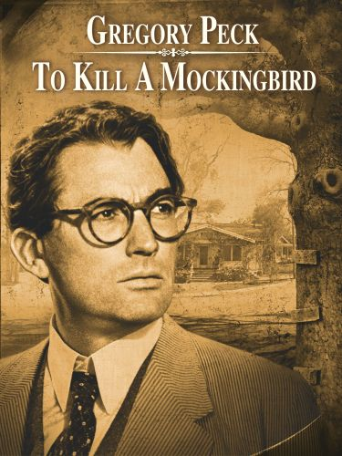
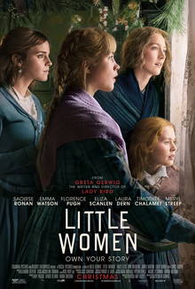
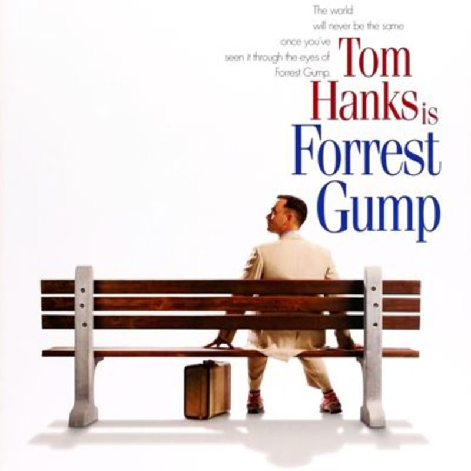

# Books made into movies

 

## To Kill a Mockingbird (1962)

The 1962 adaptation of Harper Lee’s classic, Pulitzer Prize–winning novel focuses on the deft character work Lee creates in the book. By bringing Atticus Finch, Scout, and Boo Radley to life and following the novel’s slow-burn plot structure, the film transplants the book’s two strongest elements into a movie we still can’t get enough of.

 

---
 

## The Godfather (1972, 1974)

Mario Puzo’s novel is an absorbing, dark thriller that fascinates, horrifies, and entertains. The first two films Francis Ford Coppola adapted from the novel elevate the sordid story into operatic triumphs that some consider to be two of the best films ever made. Both films won Oscars for Best Picture (Part II being the first sequel to do so) and Best Adapted Screenplay.

 

---

 

## Little Women (2019)

Despite her surprising shutout in Oscar nominations this year, there’s no doubt that Greta Gerwig did something remarkable with her adaptation of Louisa May Alcott’s classic novel (spoilers to follow!). Gerwig adds a simple twist to the story by imagining that Jo is actually the author of the novel Little Women. This transforms the story into one about creative passion and achievement, and in one stroke makes a classic feel fresh without betraying its essential nature.
 

---

 

## Forrest Gump (1994)

Forrest Gump won six Oscars, including Best Picture, and remains a divisive film in some ways — you either find it charming and filled with wisdom, or you… don’t. What can’t be argued is that it’s a film that took strong source material and created an ambitious and creative visual story from it. Winston Groom’s novel is darker and more morally complex than the streamlined character depicted by Tom Hanks, but excising that complexity in favor of a sprawling tour through the 20th century is the key to this film’s power and charm.